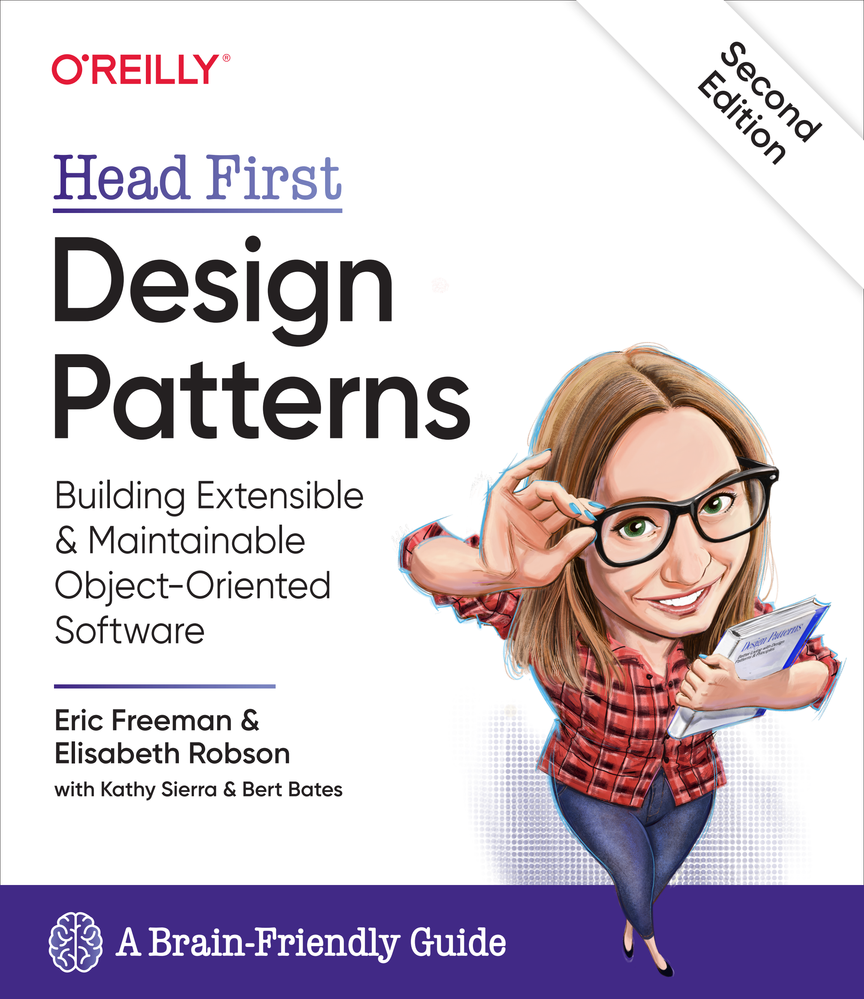

# Practical Python Design Patterns
This repository contains Python code examples from the book **“Head First Design Patterns”** (second edition). The original **Java** code has been translated to **Python** to help understand and memorize the patterns.

  

## What You’ll Find
Here are some of the patterns covered:
- **Strategy Pattern**: Defines a family of algorithms, encapsulates each one, and makes them interchangeable.
- Singleton Pattern: Ensures that a class has only one instance and provides a global point of access to it.
- Prototype Pattern: Allows creating new objects by copying an existing one, avoiding expensive object creation.
- Factory Pattern: Provides an interface for creating objects without specifying their concrete classes.
- Adapter Pattern: Converts the interface of one class into another that clients expect.
- Decorator Pattern: Dynamically adds behavior to objects without altering their structure.
- ... and more!

## Object-Oriented Design Principles
Remember these principles while working with design patterns:

- **Encapsulate What Varies**
    - Aim to encapsulate the parts of your code that are likely to change. By doing so, you isolate these variations and make your system more maintainable and flexible.
- **Open-Closed Principle (OCP)**
    - The OCP states that software entities (classes, modules, functions) should be open for extension but closed for modification.
    - In other words, you should be able to add new functionality without altering existing code. Achieve this through interfaces, abstract classes, and polymorphism.
- **Program to an Interface, Not to an Implementation**
    - Instead of relying on concrete implementations, design your code to depend on interfaces or abstract classes.
    - This promotes flexibility and allows you to switch implementations easily without affecting the rest of your system.
- **Favor Composition Over Inheritance**
    - Composition involves building complex objects by combining simpler ones (using composition relationships).
    - Favor composition over class inheritance to achieve greater flexibility and avoid the limitations of deep inheritance hierarchies.
- **Dependency Inversion Principle (DIP)**
    - High-level modules should not depend on low-level modules; both should depend on abstractions.
    - Abstractions (interfaces or abstract classes) should not depend on details; details should depend on abstractions.
    - DIP promotes loose coupling and easier maintenance.