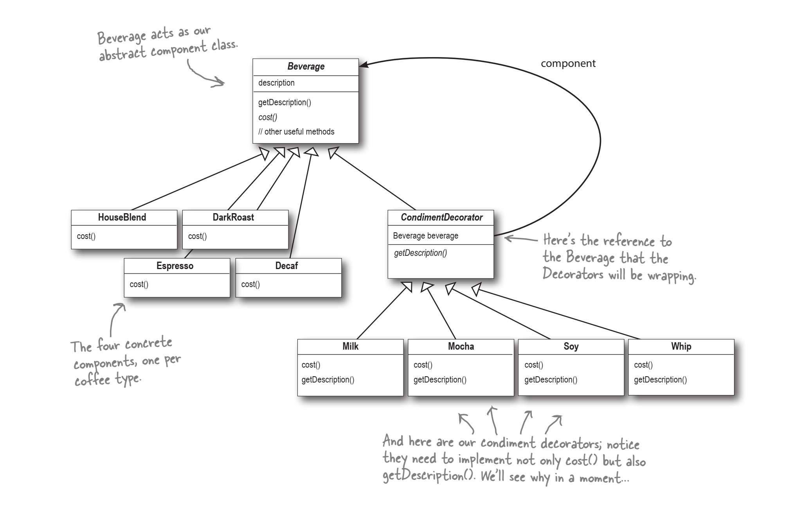

# Decorator Pattern in Python

This repository demonstrates the **Decorator Pattern**, a structural design pattern that allows behavior to be dynamically added to individual objects without affecting other objects of the same class. In this example, we create a simple beverage ordering system with decorators.

This repository contains Python code corresponding to Chapter 3 of the **“Head First Design Patterns”** book. The original code in the book is written in Java, and I’ve converted it to Python.


## Key Features
The **Decorator Pattern** in object-oriented programming consists of the following key components:

1. **Component (Interface or Abstract Class)**:
   - Represents the base interface or abstract class that defines the common behavior for both the concrete component and its decorators.
   - Contains methods that the decorators can override or extend.
   - Acts as the foundation for the entire pattern.

2. **Concrete Component**:
   - Implements the `Component` interface or extends the `Component` abstract class.
   - Represents the actual object to which decorators can be added.
   - Provides the core functionality that decorators enhance.

3. **Decorator (Abstract Class)**:
   - Also known as the wrapper class.
   - Inherits from the `Component` interface or abstract class.
   - Contains a reference to the wrapped `Component`.
   - Defines additional behavior (decorators) that can be dynamically added to the component.
   - Forwards requests to the wrapped component and may modify the results.

4. **Concrete Decorator**:
   - Extends the `Decorator` class.
   - Adds specific functionality or behavior to the wrapped component.
   - Overrides methods from the `Component` interface or abstract class to customize behavior.
   - Can be stacked to create layered functionality.

The decorator pattern allows behavior to be added to an individual object dynamically, without affecting other instances of the same class. It promotes flexibility, adheres to the Single Responsibility Principle, and supports the Open-Closed Principle by allowing functionality extension without modifying existing code.

Remember that decorators and the original object share a common set of features, making it easy to stack multiple decorators on top of each other to create complex combinations.

## Example Use Case

Suppose you're building a coffee shop application that allows customers to customize their coffee orders. You want to apply the decorator pattern to **handle different types of coffee and additional condiments**.

1. **Base Coffee Types:**
   - You have three base coffee types: Espresso, House Blend Coffee, and Dark Roast Coffee.
   - Each coffee type has a description and a cost associated with it.

2. **Condiments:**
   - You also want to allow customers to add condiments to their coffee.
   - The condiments include Mocha, Whip, and Soy.
   - Each condiment modifies the description and cost of the coffee.



3. **Applying the Decorator Pattern:**
   - You create an abstract base class called `Beverage`, which defines the basic structure for all coffee types.
   - Each specific coffee type (e.g., Espresso, House Blend, Dark Roast) extends the `Beverage` class and provides its own description and cost implementation.
   - The `CondimentDecorator` class extends `Beverage` and serves as the base class for all condiments.
   - Each condiment (e.g., Mocha, Whip, Soy) extends `CondimentDecorator` and modifies the description and cost of the wrapped beverage.

4. **Example Usage:**
   - You create an `Espresso` object and print its description and cost.
   - You create a `DarkRoast` object, add two `Mocha` condiments and one `Whip` condiment, and print the updated description and cost.
   - You create a `HouseBlend` object, add `Soy`, `Mocha` and `Whip` condiments, and print the final description and cost.

Here's how the scenario plays out:

```python
# Example usage
if __name__ == "__main__":
    
    #create an Espresso with no condiments
    beverage = Espresso()
    print(f"{beverage.get_description()} ${beverage.cost()}")

    #be careful about variables reassigning, beacause it will change the data types
    #so, it's better to create a new variable for each condiment
    #create a DarkRoast with condiments
    dark_rost = DarkRoast()
    dark_rost_mocha = Mocha(dark_rost)
    dark_rost_mocha = Mocha(dark_rost_mocha)
    dark_rost_mocha_whip = Whip(dark_rost_mocha)
    print(f"{dark_rost_mocha_whip.get_description()} ${dark_rost_mocha_whip.cost()}")

    #create a HouseBlend with condiments
    house_blend = HouseBlend()
    house_blend_soy = Soy(house_blend)
    house_blend_soy_mocha = Mocha(house_blend_soy)
    house_blend_soy_mocha_whip = Whip(house_blend_soy_mocha)
    print(f"{house_blend_soy_mocha_whip.get_description()} ${house_blend_soy_mocha_whip.cost()}")
```

In this scenario, the decorator pattern allows you to dynamically add and modify behavior (condiments) to the base coffee types without altering their core implementation. Customers can now enjoy customized coffee orders with various combinations of condiments! ☕🌟
