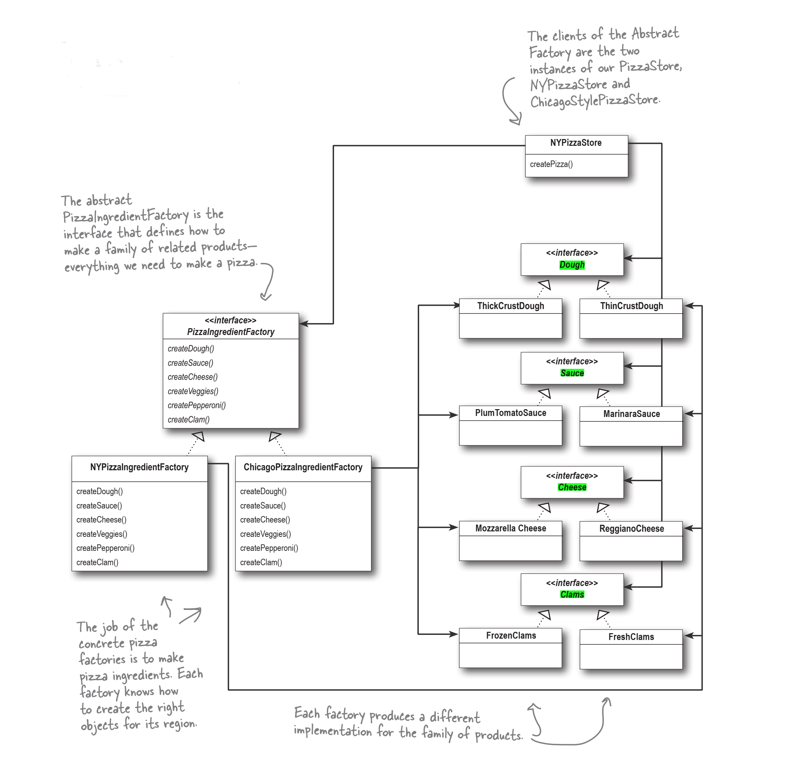

# Pizza Store Application

This project demonstrates the implementation of a Pizza Store application using the **Abstract Factory** design pattern. The application allows users to order different types of pizzas from New York and Chicago pizza stores.

This project is Python implementation of Chapter 4 of the **Head Frist Design Patterns** book. The original code is in Java and I'v converted it to Python.


- [Pizza Store Application](#pizza-store-application)
  - [Introduction](#introduction)
  - [Design Pattern](#design-pattern)
  - [Project Structure](#project-structure)
  - [Usage](#usage)
  - [Test Case](#test-case)

## Introduction

The Pizza Store application simulates ordering pizzas from two different types of pizza stores: New York and Chicago. Each store can create various types of pizzas, such as Cheese, Veggie, Clam, and Pepperoni, using their respective ingredient factories.

## Design Pattern

This project uses the **Abstract Factory** design pattern. The `PizzaStore` class is an abstract class that defines the `order_pizza` method. Subclasses (`NYPizzaStore` and `ChicagoPizzaStore`) implement the `create_pizza` method to create specific types of pizzas using their respective ingredient factories.




## Project Structure

```
└── 📁src
    └── ingredients.py
    └── main.py
    └── pizza.py
    └── pizza_ingredient_factory.py
    └── pizza_store.py
    └── test_pizza_store.py
```
- `ingredients.py`: Contains various ingredients used in pizza recipes.
- `pizza_ingredient_factory.py`: Contains the ingredient factories for New York and Chicago styles.
- `pizza.py`: Contains the pizza classes (CheesePizza, ClamPizza, PepperoniPizza, VeggiePizza).
- `pizza_store.py`: Contains the `PizzaStore` abstract class and its subclasses (`NYPizzaStore`, `ChicagoPizzaStore`).
- `main.py`: Entry point of the application.
- `pizza_store.py`: Contains test cases.

## Usage

To run the application, execute the `main.py` file:

```bash
python src/main.py
```

## Test Case

The test_pizza_store.py file contains the following tests:

1. **test_ny_pizza_store**: Validates that a Veggie pizza from the New York store has the correct name and ingredients.
2. **test_ny_pizza_store_invalid_pizza**: Checks that ordering an unsupported Greek pizza returns None.
3. **test_chicago_pizza_store**: Validates that a Pepperoni pizza from the Chicago store has the correct name and ingredients.
4. **test_chicago_pizza_store_invalid_pizza**: Checks that ordering an unsupported Greek pizza returns None.

