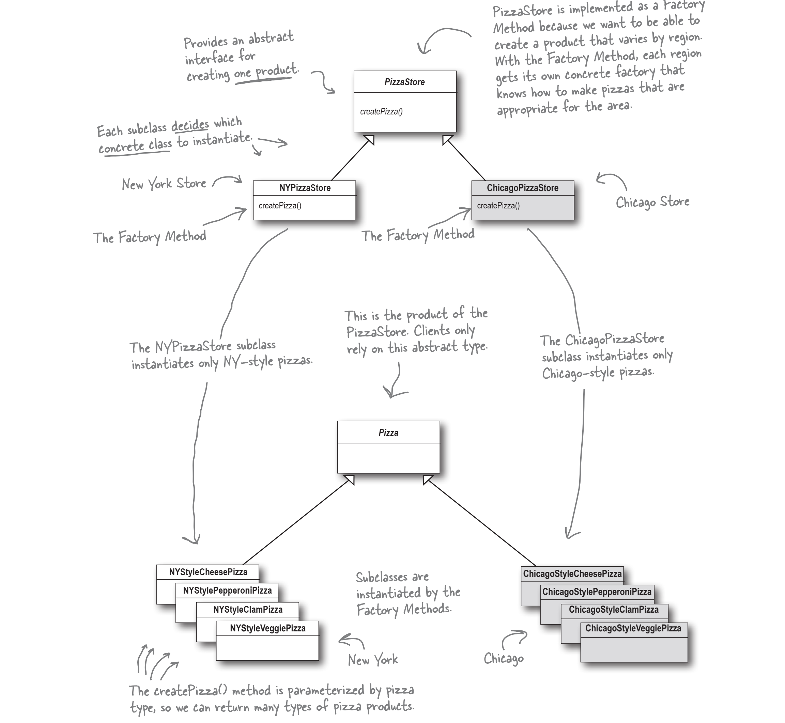

# Pizza Store Project

This project implements a pizza ordering system using the **Factory Method design pattern**. "It defines an interface for creating an object, but lets subclasses decide which class to instantiate. Factory Method lets a class defer instantiation to subclasses." [1]

This project is Python implementation of Chapter 4 of the **Head Frist Design Patterns** book. The original code is in Java and I'v converted it to Python.

This project also contains test case.

- [Pizza Store Project](#pizza-store-project)
  - [Project Overview](#project-overview)
  - [Code Structure](#code-structure)
  - [Class Descriptions](#class-descriptions)
    - [Pizza Class](#pizza-class)
      - [Chicago Style Pizzas](#chicago-style-pizzas)
      - [New York Style Pizzas](#new-york-style-pizzas)
    - [PizzaStore Class](#pizzastore-class)
      - [Concrete Pizza Stores](#concrete-pizza-stores)
  - [Usage](#usage)
  - [Test Case](#test-case)
    - [Test Cases](#test-cases)
    - [Running the Tests](#running-the-tests)
  - [References](#references)


## Project Overview

The Pizza Store project simulates a pizza ordering system where customers can order different types of pizzas. The system is designed to be extensible, allowing for the addition of new pizza styles without modifying existing code. This is achieved through the use of abstract classes and inheritance.


## Code Structure
```
└── 📁src
    └── chicago_style_pizza.py
    └── main.py
    └── ny_style_pizza.py
    └── pizza.py
    └── pizza_store.py
    └── test_pizza_store.py
```

## Class Descriptions



### Pizza Class

The `Pizza` class is an abstract base class that defines the common interface for all pizza types. It includes methods for preparing, baking, cutting, and boxing the pizza. The `name`, `dough`, `sauce`, and `toppings` attributes are initialized in the subclasses.

#### Chicago Style Pizzas

The Chicago-style pizzas inherit from the `Pizza` class and specify their unique attributes:

- `ChicagoStyleCheesePizza`
- `ChicagoStylePepperoniPizza`
- `ChicagoStyleClamPizza`
- `ChicagoStyleVeggiePizza`

Each of these classes overrides the `init` method to set specific values for `name`, `dough`, `sauce`, and toppings.

#### New York Style Pizzas

Similarly, the New York-style pizzas also inherit from the `Pizza` class:

- `NYStyleCheesePizza`
- `NYStylePepperoniPizza`
- `NYStyleClamPizza`
- `NYStyleVeggiePizza`

These classes define their unique characteristics, differentiating them from Chicago-style pizzas.

### PizzaStore Class

The `PizzaStore` class is an abstract base class that provides a method to order pizzas. It contains an abstract method `create_pizza` that must be implemented by subclasses. This class uses **composition** to delegate the creation of pizzas to its subclasses.

#### Concrete Pizza Stores

- `NYPizzaStore`: This concrete implementation of `PizzaStore` creates New York-style pizzas based on the type requested. It overrides the `create_pizza` method to return instances of the appropriate pizza classes.
- `ChicagoPizzaStore`: This concrete implementation of `PizzaStore` creates Chicago-style pizzas based on the type requested. It overrides the `create_pizza` method to return instances of the appropriate pizza classes.


## Usage

To use the Pizza Store system, you can create an instance of `NYPizzaStore` and `ChicagoPizzaStore` and call the `order_pizza` method with the desired pizza type:

```python
if __name__ == '__main__':
    ny_store = NYPizzaStore()
    chicago_store = ChicagoPizzaStore()

    ny_store.order_pizza('cheese')
    chicago_store.order_pizza('cheese')
```


## Test Case
This repository contains unit tests for the `PizzaStore` classes. The tests ensure that the correct types of pizzas are created and that invalid pizza orders are handled appropriately.

### Test Cases
The following test cases are included:

- **New York Pizza Store Tests**
  - `test_ny_store_order_cheese_pizza`: Tests ordering a cheese pizza from the New York pizza store.
  - `test_ny_store_order_veggie_pizza`: Tests ordering a veggie pizza from the New York pizza store.
  - `test_ny_store_order_invalid_pizza`: Tests ordering an invalid pizza type from the New York pizza store.

- **Chicago Pizza Store Tests**
  - `test_chicago_store_order_cheese_pizza`: Tests ordering a cheese pizza from the Chicago pizza store.
  - `test_chicago_store_order_veggie_pizza`: Tests ordering a veggie pizza from the Chicago pizza store.
  - `test_chicago_store_order_invalid_pizza`: Tests ordering an invalid pizza type from the Chicago pizza store.

### Running the Tests
To run the tests, use the following commands:

```bash
python -m unittest src/test_pizza_store.py
```

## References
1. Head Frist Design Pattern, Chapter 4, Page: 134