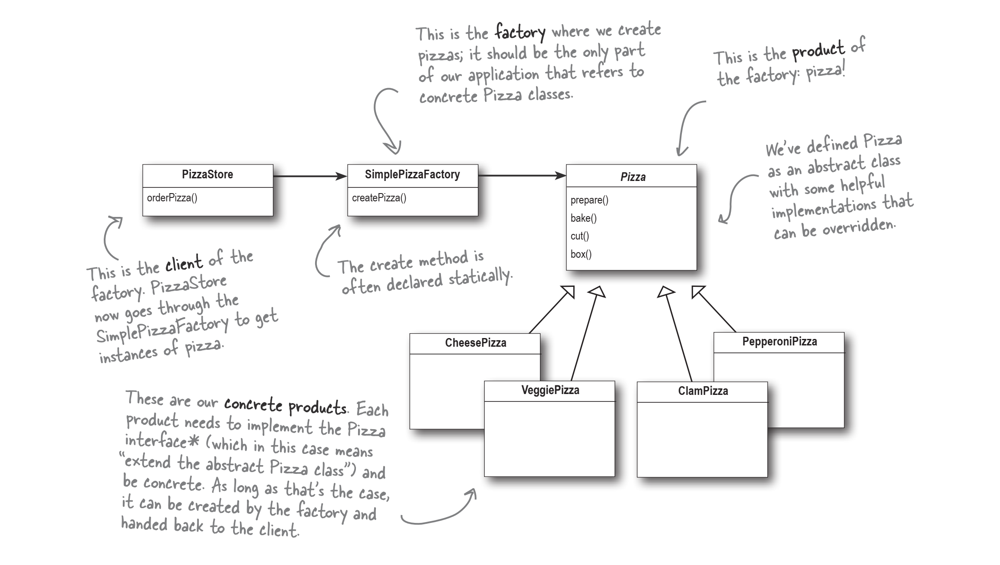

# Simple Factory in Python

This repository demonstrates the Simple Factory Pattern in Python. The content and code are inspired by Chapter 4 of the book "Head First Design Patterns". The original code was written in Java and has been converted to Python.

## Overview

The Simple Factory Pattern is a straightforward way to decouple clients from concrete classes. It involves a single method that returns instances of different classes based on input parameters. This approach simplifies object creation and reduces the dependency on specific classes.




## Classes

### `Pizza` (Abstract Base Class)
The `Pizza` class is the base class for all pizza types. It defines the common interface and behavior for all pizzas.
- `CheesePizza` (Concrete Class)
A concrete implementation of the `Pizza` class representing a cheese pizza.

- `ClamPizza` (Concrete Class)
A concrete implementation of the `Pizza` class representing a clam pizza.

- `VeggiePizza` (Concrete Class)
A concrete implementation of the `Pizza` class representing a veggie pizza.

- `PepperoniPizza` (Concrete Class)
A concrete implementation of the `Pizza` class representing a pepperoni pizza.

### `SimplePizzaFactory`
The `SimplePizzaFactory` class is responsible for creating instances of different pizza types based on the input parameter.

### `PizzaStore`
The `PizzaStore` class uses the `SimplePizzaFactory` to create and order pizzas.

- **Attributes**:
  - `factory`: An instance of `SimplePizzaFactory`.

- **Methods**:
  - `order_pizza(item: str) -> Pizza`: Orders a pizza of the specified type, prepares it, bakes it, cuts it, and boxes it.

## Usage

To use this implementation, you can create instances of different pizza types and call their methods. Here's an example:

```python
if __name__ == "__main__":
    factory = SimplePizzaFactory()
    pizza_store = PizzaStore(factory)
    pizza = pizza_store.order_pizza(item='cheese')
```