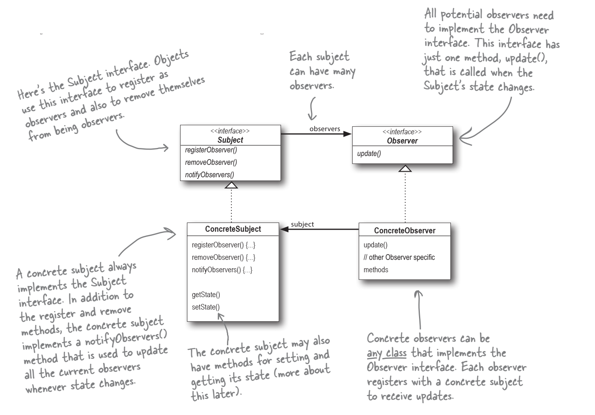
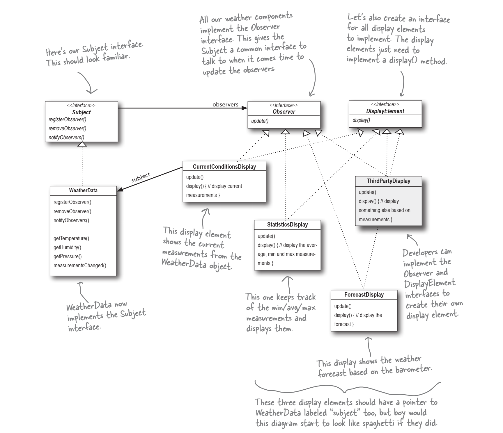

# Observer Pattern in Python

## Overview
The Observer Pattern establishes a one-to-many dependency between objects, ensuring that when one object changes state, all its dependents are automatically notified and updated. This pattern is particularly useful for scenarios where multiple objects need to react to changes in a subject.
This repository contains Python code corresponding to Chapter 2 of the **“Head First Design Patterns”** book. The original code in the book is written in Java, and I’ve converted it to Python.


## Key Concepts and Implementation
1. **Subject or Publisher (`Subject` class)**: Represents the object being observed. It maintains a list of observers and notifies them when its state changes.
2. **Observer (`Observer` class)**: Objects that want to track changes in the subject’s state. They subscribe to the subject and react to notifications.

## Example Use Case
Suppose we have a weather monitoring system. The weather station (subject) collects data such as temperature, humidity, and pressure. Various displays (observers) need to stay up-to-date with this data. By using the Observer Pattern, we can ensure that when the weather station’s data changes, all connected displays receive timely updates.



### Python code: 
```python
weather_data = WeatherData()
CurrentConditionsDisplay(weather_data)
print('observers: ', weather_data.observers)
weather_data.set_measurements(80, 65, 30.4)
weather_data.set_measurements(82, 70, 29.2)
weather_data.set_measurements(78, 90, 29.2)
```
### In this example:
- The `WeatherData` class represents the subject (observable).
- It maintains a set of registered observers and notifies them when measurements change.
- The `CurrentConditionsDisplay` class is an observer.
- It displays the current weather conditions based on the data received from the` WeatherData` subject.
- The `set_measurements` method updates temperature, humidity, and pressure.

## Running the Simulation
To run this simulation:
1. Clone this repository.
2. Navigate to the source directory.
3. Run `python main.py`.